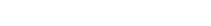

  
  

<h1 align="center">About me</h1>

I am a Mechatronics Engineer with a background in automation, mechanical design, and electronics. I have integrated artistic and multimedia skills into my technical workflow: 3D modeling, digital illustration, animation, and music production. I write code as a junior developer and act as a bridge between technical requirements and non-technical stakeholders.

<h2 align="center">CORE PROFILE</h2>

- **Mechatronics Engineering:** Design and automation of systems integrating mechanics, electronics, and control (CAD, sensors, and microcontrollers) to solve physical and process-related problems.
- **Software Development:** Creation of digital tools and functional applications (Python, JavaScript, Frontend), translating logical requirements into efficient and usable code.
- **Multimedia Production:** Development of high-quality visual and audio assets (3D Modeling with Blender, illustration in Krita, audio in Ableton) for technical or creative communication.
- **Multidisciplinary Collaboration:** Ability to act as a liaison between specialists from various fields (medicine, art, engineering), ensuring ideas are understood and executed correctly regardless of technical barriers.

<h2 align="center">TECHNICAL SKILLS</h2>

**Software and Programming:** I will develop efficient applications, tools, and data logic with:

- Languages: Python, C++, JavaScript, HTML/CSS, JSON/YAML.
- Databases: SQLite, TinyDB, SQL, Relational Design.
- Environment: Git, GitHub, VS Code, Linux Shell.

**Hardware, Control, and Automation:** I will design physical systems, mechanisms, and automated processes with:

- Mechanical Design (CAD/CAM): SolidWorks, SolidEdge, AutoCAD, CNC.
- Electronics and Control: Arduino, PIC, PLC, LabVIEW.
- Instrumentation: Sensors, Actuators, Oscilloscope, MATLAB.

**Multimedia and Creative Design:** I will create interfaces, attractive visuals, and sound experiences with:

- Graphics and 3D: Blender (Modeling/Animation), Krita, Inkscape, Gimp, Enve.
- Audio Production: LMMS, Ableton Live, FL Studio.

<h2 align="center">WORK ECOSYSTEMS</h2>

- Diverse and multidisciplinary teams, involving both technical and non-technical profiles.
- Projects where software intersects with other disciplines: art, health, education, social sciences, or communication.
- Workspaces that value clear communication between engineering, other sciences, and humanities or creative fields.

<h2 align="center">PROJECTS</h2>

**In Development:**

**Maintenance/Revision Only:**

**In Planning:**

<h2 align="center">CONTACT</h2>

  📧 <b>Email:</b> <a href="mailto:doc.oliveroe95@gmail.com">doc.oliveroe95@gmail.com</a> 
  🐙 <b>GitHub:</b> <a href="https://github.com/OliverOnForge">OliverOnForge</a> 
  💼 <b>LinkedIn:</b> <a href="https://www.linkedin.com/in/oliveronforge">oliveronforge</a>

