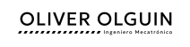
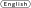
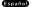
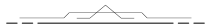
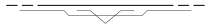
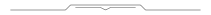
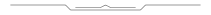

<picture>
  <source media="(prefers-color-scheme: dark)" srcset="../assets/header-es-wt.svg">
  <source media="(prefers-color-scheme: light)" srcset="../assets/header-es-bk.svg">
  
</picture>

  <a href="../README.md">
    <picture>
      <source media="(prefers-color-scheme: dark)" srcset="../assets/en-unselect-wt.svg">
      <source media="(prefers-color-scheme: light)" srcset="../assets/en-unselect-bk.svg">
      
    </picture>
  </a>
  <a href="README-es.md">
    <picture>
      <source media="(prefers-color-scheme: dark)" srcset="../assets/es-select-wt.svg">
      <source media="(prefers-color-scheme: light)" srcset="../assets/es-select-bk.svg">
      
    </picture>
  </a>

<picture>
  <source media="(prefers-color-scheme: dark)" srcset="../assets/ornament-up-wt.svg">
  <source media="(prefers-color-scheme: light)" srcset="../assets/ornament-up-bk.svg">
  
</picture>

<h1 align="center">Sobre mí</h1>

Soy Ingeniero Mecatrónico con experiencia en automatización, diseño mecánico y electrónica. He integrado habilidades artísticas y multimedia en mi flujo de trabajo técnico: modelado 3D, ilustración digital, animación y producción musical. Escribo código como desarrollador junior y actúo como puente entre requerimientos técnicos y partes interesadas no técnicas.

<picture>
  <source media="(prefers-color-scheme: dark)" srcset="../assets/ornament-dn-wt.svg">
  <source media="(prefers-color-scheme: light)" srcset="../assets/ornament-dn-bk.svg">
  
</picture>

<picture>
  <source media="(prefers-color-scheme: dark)" srcset="../assets/border-up-wt.svg">
  <source media="(prefers-color-scheme: light)" srcset="../assets/border-up-bk.svg">
  
</picture>

<h2 align="center">PERFIL CENTRAL</h2>

- **Ingeniería Mecatrónica:** Diseño y automatización de sistemas que integran mecánica, electrónica y control (CAD, sensores y microcontroladores) para resolver problemas físicos y de procesos.
- **Desarrollo de Software:** Creación de herramientas digitales y aplicaciones funcionales (Python, JavaScript, Frontend), traduciendo requisitos lógicos en código eficiente y utilizable.
- **Producción Multimedia:** Desarrollo de activos visuales y auditivos de alta calidad (Modelado 3D con Blender, ilustración en Krita, audio en Ableton) para comunicación técnica o creativa.
- **Colaboración Multidisciplinaria:** Capacidad para actuar como enlace entre especialistas de diversos campos (medicina, arte, ingeniería), asegurando que las ideas se comprendan y ejecuten correctamente sin importar las barreras técnicas.

<picture>
  <source media="(prefers-color-scheme: dark)" srcset="../assets/border-dn-wt.svg">
  <source media="(prefers-color-scheme: light)" srcset="../assets/border-dn-bk.svg">
  
</picture>

<picture>
  <source media="(prefers-color-scheme: dark)" srcset="../assets/border-up-wt.svg">
  <source media="(prefers-color-scheme: light)" srcset="../assets/border-up-bk.svg">
  
</picture>

<h2 align="center">HABILIDADES TÉCNICAS</h2>

**Software y Programación:** Desarrollo aplicaciones eficientes, herramientas y lógica de datos con:

- Lenguajes: Python, C++, JavaScript, HTML/CSS, JSON/YAML.
- Bases de Datos: SQLite, TinyDB, SQL, Diseño Relacional.
- Entorno: Git, GitHub, VS Code, Linux Shell.

**Hardware, Control y Automatización:** Diseño sistemas físicos, mecanismos y procesos automatizados con:

- Diseño Mecánico (CAD/CAM): SolidWorks, SolidEdge, AutoCAD, CNC.
- Electrónica y Control: Arduino, PIC, PLC, LabVIEW.
- Instrumentación: Sensores, Actuadores, Osciloscopio, MATLAB.

**Multimedia y Diseño Creativo:** Creo interfaces, visuales atractivos y experiencias sonoras con:

- Gráficos y 3D: Blender (Modelado/Animación), Krita, Inkscape, Gimp, Enve.
- Producción de Audio: LMMS, Ableton Live, FL Studio.

<picture>
  <source media="(prefers-color-scheme: dark)" srcset="../assets/border-dn-wt.svg">
  <source media="(prefers-color-scheme: light)" srcset="../assets/border-dn-bk.svg">
  
</picture>

<picture>
  <source media="(prefers-color-scheme: dark)" srcset="../assets/border-up-wt.svg">
  <source media="(prefers-color-scheme: light)" srcset="../assets/border-up-bk.svg">
  
</picture>

<h2 align="center">ECOSISTEMAS DE TRABAJO</h2>

- Equipos diversos y multidisciplinarios, que involucran perfiles tanto técnicos como no técnicos.
- Proyectos donde el software se cruza con otras disciplinas: arte, salud, educación, ciencias sociales o comunicación.
- Espacios de trabajo que valoran la comunicación clara entre ingeniería, otras ciencias y humanidades o campos creativos.

<picture>
  <source media="(prefers-color-scheme: dark)" srcset="../assets/border-dn-wt.svg">
  <source media="(prefers-color-scheme: light)" srcset="../assets/border-dn-bk.svg">
  
</picture>

<picture>
  <source media="(prefers-color-scheme: dark)" srcset="../assets/border-up-wt.svg">
  <source media="(prefers-color-scheme: light)" srcset="../assets/border-up-bk.svg">
  
</picture>

<h2 align="center">PROYECTOS</h2>

**En Desarrollo:**

**Solo Mantenimiento/Revisión:**

**En Planificación:**

<picture>
  <source media="(prefers-color-scheme: dark)" srcset="../assets/border-dn-wt.svg">
  <source media="(prefers-color-scheme: light)" srcset="../assets/border-dn-bk.svg">
  
</picture>

<picture>
  <source media="(prefers-color-scheme: dark)" srcset="../assets/border-up-wt.svg">
  <source media="(prefers-color-scheme: light)" srcset="../assets/border-up-bk.svg">
  
</picture>

<h2 align="center">CONTACTO</h2>

  📧 <b>Email:</b> <a href="mailto:doc.oliveroe95@gmail.com">doc.oliveroe95@gmail.com</a> 
  🐙 <b>GitHub:</b> <a href="https://github.com/OliverOnForge">OliverOnForge</a> 
  💼 <b>LinkedIn:</b> <a href="https://www.linkedin.com/in/oliveronforge">oliveronforge</a>

<picture>
  <source media="(prefers-color-scheme: dark)" srcset="../assets/border-dn-wt.svg">
  <source media="(prefers-color-scheme: light)" srcset="../assets/border-dn-bk.svg">
  
</picture>
